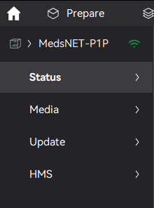

# BambuStudio - Add Local Printer by IP
BambuStudio does not support adding printers by IP address, 
instead relying on UDP broadcasts by the printer itself to see it as discoverable.

That poses an issue if your printer is set up on a designated __IOT VLAN__ _(In PFSENSE, OpenSense, etc)_, 
or the UDP broadcast doesn't get received for any other reason. 
_(There is an open [Github issue](https://github.com/bambulab/BambuStudio/issues/1549) about this)_

This script fixes that, by launching BambuStudio, waiting a set amount of time, and sending a UDP packet containting
the printer information to BambuStudio! Letting you add the printer by IP.

This should work both in LAN mode and outside... But I've only tested it in LAN mode.
I also haven't tested how/if the camera works using this method, since I don't have one.

Based off a shell script by [Gashton](https://github.com/gashton/bambustudio_tools/tree/master), 
just made multi platform by using Python instead. Without their work this wouldn't be possible. <3

## Installation

### Windows
- Install [Python3](https://www.python.org/downloads/)
- Clone this repo / Download it as a zip and unzip to a folder
- Set all the config variables
- (Optional) Change the bambulab shortcut on the desktop to launch the script
  - Right click on the BambuLab shortcut
  - Change the `Target` field to the following (Replacing `<PATH_TO_MAIN_PY>` with the actual path to main.py file you downloaded)
    - `python "<PATH_TO_MAIN_PY>"`

### Linux
- Intall Python3
- Clone repo
- Set the config variables, change `RUN_BSTUDIO` to false

You may want to setup the script to run on a timer if you are using it on a different device!

### MacOS
(UNTESTED!)
- Install Python3
  - Run `python --version` if it prompts you to install XCode dev tools, follow the wizard
  - If it doesn't run `xcode-select --install`
- Clone the repo, or download it as a zip
- Edit the `config.py` file, make sure to change the `BSTUDIO_PATH` to the installed path
- Run the script

_I'm currently unsure of how to make a GUI shortcut to the script in MacOS...
This is also untested since I don't have a MacOS machine nearby, but should work... Hopefully_

## Config

The script configuration resides in `config.py`

Here's all the config switches and what to set there:
- `TARGET_IP` - The IP address of the computer that runs BambuStudio
- `PRINTER_IP` - The IP address of the Printer
- `PRINTER_USN` - The Unique Serial Number of the Printer (You can find this in the printer settings menu on the LCD)
- `PRINTER_DEV_MODEL` - The printer model (__X1 Carbon__: "3DPrinter-X1-Carbon", __X1__: "3DPrinter-X1", __P1P__: "C11")
- `PRINTER_DEV_NAME` - The printer device name (Can be anything, it's what BambuStudio shows the pritner as)
- `RUN_BSTUDIO` - Should the script run BambuStudio?
- `BSTUDIO_PATH` - The path to BambuStudio
- `WAIT_TIME` - The amount of time for the script to wait before sending the magic packet

